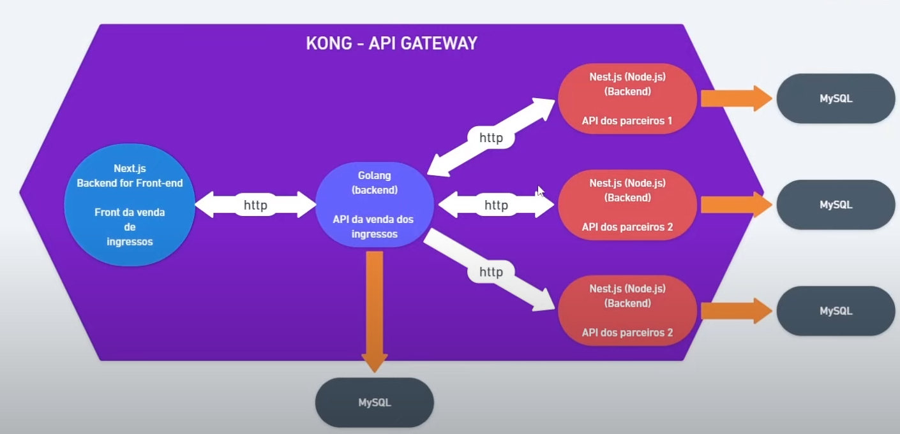
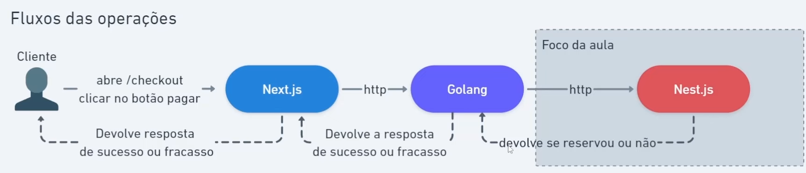

# dev-full-cycle

## Full Cycle

1. Operate what you build (Operar o que constroi)
    > Responsabilidade da consepção até a entrega.
2. Ferramentas para Escalar

## FullCycle x FullStack
* **FullStack:** Dev dominando stacks e linguagens para programar em diversas perspectivas.
* **FullCycle:** Além de desenvolver ele consegue arquitetar e entregar a aplicação testada e deployada, assim como, escalaveis.

> além do CRUD

## Ordem do desenvolvimento

* [**Day 1:** API de Parceiros - Nest.js](doc/Day1.md)
* **Day 2:** API Gateway - Kong
* **Day 3:** Sistema de gerenciamento de ingressos - GO
* **Day 4:** Frontend - Next.js
* **Day 5:** integração

## Arquitetura do Sistema

